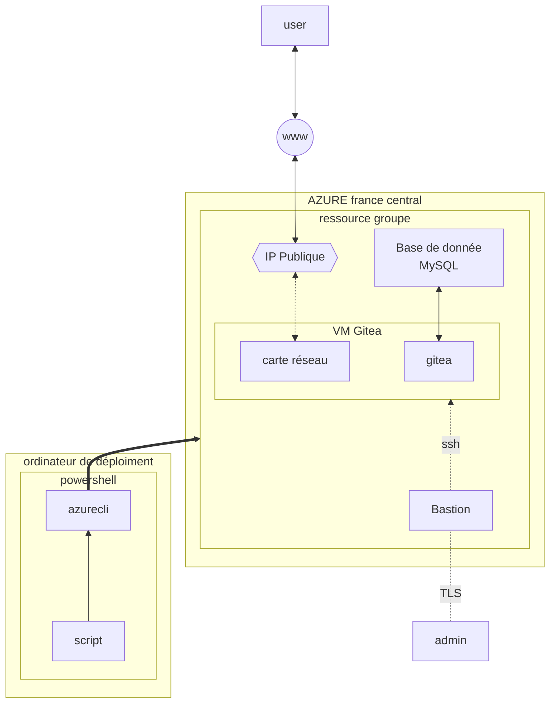

# Plan brief 3

## Liste des ressources Azure

- un groupe de ressource
- un réseau avec deux sous réseaux
- une VM A series medium, 2 CPU, 3,5 GiO de RAM, deux disques et Ubuntu 20 pour OS 
- un service Bastion
- un service base de donnée MySQL
- deux IP publiques
- app insight

## Liste des tâches

1. Plan de la topologie
2. Consultation de la documentation **Azure CLI**
3. Consultation de la documentation **Gitea**
4. Consultation de la documentation **Azure BASTION**
5. Consultation de la documentation **Azure BDD**
6. Consultation de la documentation **Application Insights**
7. Faire une installation à blanc de Gitea
8. Faire un script de nettoyage de la région Azure 
9. Installer Azure CLI sur chaque poste en local qui pourra déployer les ressources.
10. Ecrire le script 
    * Commande Azure CLI qui crée un groupe de ressource
    * Commande Azure CLI de création d'un réseau virtuel avec deux sous réseaux
    * Commande Azure CLI de création de l'IP publique pour la rattacher au service Bastion
    * Commande Azure CLI de création d'un service Bastion
    * Commande Azure CLI de création de la VM hôte de Gitea
    * Commande Azure CLI de création de la base de donnée MySQL
    * Installer Gitea
    * Configurer les ports
    * Créer une URL
    * Certifier l'URL avec Certbot, avec le renouvellement automatique
    * Installer app insight
    * Configurer la rétention des logs
    * Configurer app insight
12. Test du script
13. On contemple notre oeuvre

*N.B : Au fur et a mesure, création de la documentation technique*
